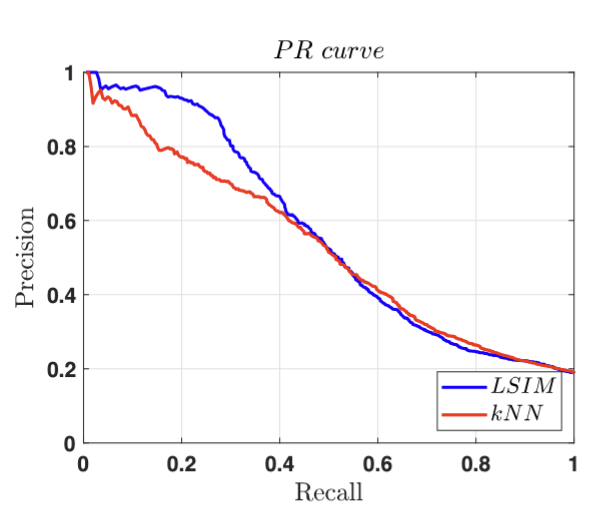

# Multivariate Transfer Entropy Estimation using Coupled Hidden Markov Models

This repository contains MATLAB codes for estimating Multivariate Transfer Entropy (MTE) using Coupled Hidden Markov Models (CHMMs), specifically Latent Structure Influence Models (LSIMs). The implementation is based on research published in the IEEE ICBME 2022 conference.

## 📋 Abstract

Studying complex dynamical systems such as the brain requires identifying causal relationships from brain signals like EEG. In such systems, causal inference is challenging since datasets are often high-dimensional, nonlinear, noisy, and often with small sample sizes. Using multivariate transfer entropy (MTE), causal relationships can be inferred in linear and nonlinear ways.

In this study, latent structure influence models (LSIMs) are adapted to develop a novel MTE estimator that measures effective connectivity in multivariate time series. LSIMs are a specific type of coupled hidden Markov model (CHMM) in which hidden Markov chain interactions are expressed as influence models.

Simulated datasets from neural mass models (NMMs) are used to compare the proposed estimator with the existing k-nearest neighbors (kNN) method at different conditions, including data length, signal-to-noise ratio, and network size. Using ground-truth structure networks, we define a binary classification problem for recovering directed edges from NMM simulation datasets in each specific condition.

**Key Finding**: Based on the AUCPR criterion, the proposed MTE estimator for NMMs is more effective than the standard kNN method. The proposed LSIM-based method outperforms the existing kNN method by about 3.7% in AUCPR values for SNRs in the range of 0 dB to 5 dB.

## 📚 Citation

```bibtex
@inproceedings{karimi2022coupled,
  title={Coupled Hidden Markov Models for Estimating Multivariate Transfer Entropy in Neural Mass Models: A Simulation Study},
  author={Karimi, S. and Shamsollahi, M.B.},
  booktitle={2022 29th National and 7th International Iranian Conference on Biomedical Engineering (ICBME)},
  pages={14--21},
  year={2022},
  organization={IEEE}
}
```

## 🏗️ Repository Structure

```
mte-estimation/
├── main_nms_connectivity.m          # Main simulation script
├── paper_plots.m                    # Script to generate paper figures
├── nms_connectivity_data.m          # Neural mass model data generation
├── H_methods_IT_corrected.m        # HERMES toolbox integration
├── prec_rec.m                      # Precision-recall curve computation
├── nms_mte_results.mat             # Pre-computed results
├── pr-curve.png                    # Sample PR curve image
├── figs/                           # Generated figures directory
├── chmm-lsim-matlab-toolbox-main/  # CHMM-LSIM toolbox
└── HERMES Toolbox/                 # HERMES connectivity toolbox
```

## 🚀 Quick Start

### Prerequisites

1. **MATLAB** (R2018b or later recommended)
2. **Dependencies**:
   - [CHMM-LSIM MATLAB Toolbox](https://github.com/sajjadkarimi91/chmm-lsim-matlab-toolbox)
   - [HERMES Toolbox](https://github.com/guiomar/HERMES)

### ⚠️ Important System Compatibility Note

**HERMES Toolbox MEX File Dependency**: The HERMES toolbox requires compiled MEX files (`tim_matlab.mex*`) that are platform-specific. If you encounter the following error:

```
Unrecognized function or variable 'tim_matlab'.
Error in entropy_combination (line 95)
    I(i) = tim_matlab(...
```

**Solutions by Operating System:**

- **Windows**: MEX files are typically included and should work out-of-the-box
- **macOS/Linux**: You may need to compile the MEX files manually:
  1. Navigate to `HERMES Toolbox/lib/tim-matlab-1.2.0/`
  2. Run `mex tim_matlab.c` in MATLAB
  3. Ensure the compiled file is in your MATLAB path

**Alternative**: If MEX compilation fails, you can still run the LSIM-based comparisons by commenting out the HERMES-related code in `main_nms_connectivity.m` (lines 113-120).

### Installation

1. Clone this repository:
   ```bash
   git clone https://github.com/your-username/mte-estimation.git
   cd mte-estimation
   ```

2. Add the required toolboxes to your MATLAB path:
   ```matlab
   addpath(genpath('chmm-lsim-matlab-toolbox-main'))
   addpath(genpath('HERMES Toolbox'))
   ```

### Running the Simulations

1. **Generate simulation data and results**:
   ```matlab
   main_nms_connectivity
   ```
   This script will:
   - Generate neural mass model simulations
   - Apply different noise levels (SNR: -10 to 20 dB)
   - Test various network sizes (3, 5, 10 channels)
   - Compare LSIM vs kNN methods
   - Save results to `nms_mte_results.mat`

2. **Generate paper figures**:
   ```matlab
   paper_plots
   ```
   This will create:
   - ROC curves
   - Precision-Recall curves
   - Performance comparison plots
   - All figures saved in `figs/` directory

## 📊 Results

### Performance Comparison

The proposed LSIM-based MTE estimator shows superior performance compared to the standard kNN method across various conditions:

#### AUCPR Differences (LSIM - kNN) for T=500

| Channels | SNR (dB) |  |  |  |  |  |  |
|----------|----------|--|--|--|--|--|--|
|          | -10      | -5 | 0 | 5 | 10 | 15 | 20 |
|----------|----------|----|----|----|----|----|----|
| 3        | -1.7     | 3.5 | 4.7 | 1.1 | -0.4 | -1.8 | -0.6 |
| 5        | -0.3     | 5.5 | 3.0 | 1.0 | 1.4 | 2.6 | 2.5 |
| 10       | 0.5      | 1.9 | 3.6 | 4.1 | 3.2 | 1.0 | 0.3 |
|----------|----------|----|----|----|----|----|----|
| **Avg**  | **-0.5** | **3.6** | **3.8** | **2.1** | **1.4** | **0.6** | **0.7** |

**Key Observations:**
- Best performance at SNR = 0 dB with 3.8% improvement
- Consistent improvements across most SNR levels
- Robust performance across different network sizes

### Sample Results



*Comparison of PR curves in 10-channel NMM simulations at SNR=0dB and T=500*

## 🔬 Methodology

### Neural Mass Models (NMMs)
- Simulated EEG-like signals using coupled neural mass models
- Excitatory and inhibitory synaptic connections
- Realistic brain connectivity patterns

### Transfer Entropy Estimation
1. **LSIM Method**: Uses coupled hidden Markov models with latent structure influence
2. **kNN Method**: Traditional k-nearest neighbors approach
3. **Evaluation**: Binary classification of directed edges using ground truth

### Experimental Design
- **Network Sizes**: 3, 5, 10 channels
- **Data Lengths**: 100, 200, 500, 1000 time points
- **SNR Levels**: -10 to 20 dB (7 levels)
- **Evaluation Metrics**: AUCPR, AUROC, Precision, Recall

## 📈 Key Contributions

1. **Novel MTE Estimator**: First application of LSIMs for transfer entropy estimation
2. **Robust Performance**: Superior results under noisy conditions
3. **Scalable Framework**: Works across different network sizes and data lengths
4. **Comprehensive Evaluation**: Thorough comparison with state-of-the-art methods

## 🔧 Configuration

### Main Parameters (in `main_nms_connectivity.m`)

```matlab
% Simulation parameters
max_iteration = 100;           % Maximum EM iterations
num_surrogate = 20;           % Number of surrogate tests
T_durations = [100,200,500,1000];  % Data lengths
db_vals = -10:5:20;          % SNR levels (dB)
channels(1).num = [3,5,10];  % Network sizes

% Model parameters
n_lags_hermes = 2;           % HERMES lag parameter
n_lags_lsim = 1;             % LSIM lag parameter
fs = 100;                    % Sampling frequency
```

## 📝 Dependencies

### CHMM-LSIM Toolbox
- **Source**: [GitHub Repository](https://github.com/sajjadkarimi91/chmm-lsim-matlab-toolbox)
- **Purpose**: Provides the core LSIM implementation
- **Key Functions**: `em_lsim`, `te_embed_lsim`, `forward_backward_lsim`

### HERMES Toolbox
- **Source**: [GitHub Repository](https://github.com/guiomar/HERMES)
- **Reference**: Niso, G., et al. (2013). HERMES: towards an integrated toolbox to characterize functional and effective brain connectivity. Neuroinformatics, 11(4), 405-434.
- **Purpose**: Provides kNN-based transfer entropy estimation for comparison

## 🔧 Troubleshooting

### Common Issues

1. **MEX File Error** (most common):
   ```
   Unrecognized function or variable 'tim_matlab'
   ```
   - **Cause**: Platform-specific MEX files not compiled
   - **Solution**: See "Important System Compatibility Note" above

2. **Path Issues**:
   ```matlab
   % Ensure all toolboxes are in MATLAB path
   addpath(genpath('chmm-lsim-matlab-toolbox-main'))
   addpath(genpath('HERMES Toolbox'))
   addpath(genpath('.'))
   ```

3. **Memory Issues**:
   - Large simulations may require significant RAM
   - Consider reducing `max_repeat` or `T_durations` for testing

4. **Compilation Errors on macOS/Linux**:
   - Ensure you have a C compiler installed
   - Try: `mex -setup C` in MATLAB
   - For macOS: Install Xcode Command Line Tools

## 🤝 Contributing

1. Fork the repository
2. Create a feature branch
3. Make your changes
4. Add tests if applicable
5. Submit a pull request

## 📄 License

This project is licensed under the MIT License - see the LICENSE file for details.

## 👥 Authors

- **Sajjad Karimi** - Initial work
- **M.B. Shamsollahi** - Supervision and guidance

## 🙏 Acknowledgments

- Neural mass model implementation based on established literature
- HERMES toolbox for comparison methods
- MATLAB community for computational tools

---

*For questions or issues, please open an issue on the GitHub repository.*
